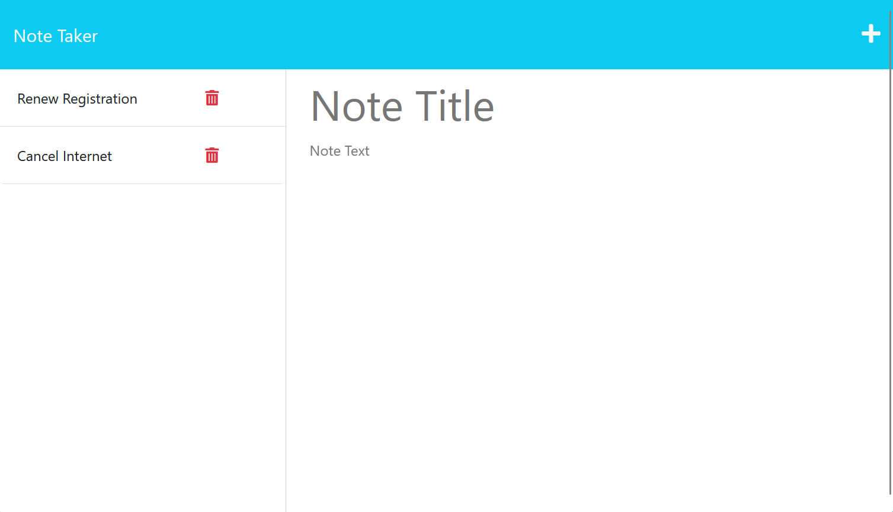

# Note Taker 

  ## Description
  
  An app that can be used to write and save notes. It uses an Express.js back end and saves and retrieves note data from a JSON file.
  
  ## Table of Contents
  
  -[Screenshot](#screenshot)

  -[Link to deployed application](#link-to-deployed-application)

  -[License](#license)

  -[Credits](#credits)
  
  ## Screenshot
  
  
  
  ## Link to deployed application
  
  https://git.heroku.com/note-taker-sife
  
  ## License
  
  None

  ## Credits
  
  W3Schools
  StackOverflow
  UNB Bootcamp Activities